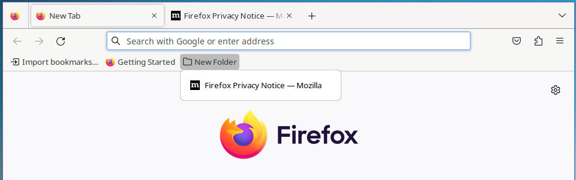
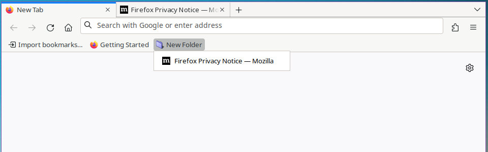

# 🦊 ffox_profile_tools 🐧

firefox profiles with security presets &amp; userchrome styles

## Summary

The purpose of this project is to provide a way to create new firefox profiles with security & privacy settings already preset.

It also includes some style customizations using `userChrome.css`.

## Usage

Clone this repo and copy the files somewhere accessible.

You can then rename/copy the script to the profile name required (script filename = profile name).

Optionally you may also want to change the `profile_folder` variable (default is $HOME/.ffox_profiles)

## Features

Creation of new profiles with:

- [x] Security & Privacy Related Settings Pre-Set
- [x] Find At Top Of Screen
- [x] RAM Caching Enabled
- [x] Sandbox Check (user namespaces kernel setting)
- [x] Auto Update Profile Preferences
- [x] Bookmark Bar Spacing
- [x] Disable Ugly `urlbar` Zoom (firefox >75)
- [x] Disable Ugly Drop Shadow On Search
- [x] Disable Search Suggestions
- [x] Disable Sponsored Suggestions
- [x] Restore Old Square Tabs
- [x] Smaller Tab Density
- [x] Cleaner Image Context Menu
- [x] Smaller Bookmark Menu Spacing

## Screenshot

### userChrome Comparison

Here is a comparison to show the changes made with the userChrome styles.

#### Firefox Default

#### Firefox userChrome Applied

## Short Changelog

    # 19-05-2015 -  initial script with tweaks
    # ref: https://equk.co.uk/2015/05/19/firefox-scripts/
    #
    # 06-06-2015 -  disable pocket (bundled with firefox)
    # 08-09-2018 -  added userChrome.css
    # ref: https://equk.co.uk/2018/09/12/firefox-profile-tools/
    #
    # 08-04-2019 -  added Enable U2F (FIDO) Authentication
    # 11-09-2019 -  disable centralized DNS queries DNS-over-HTTPS to cloudflare
    # 02-06-2020 -  Fix Ugly urlbar Zoom (firefox >75) to userChrome
    # 16-09-2020 -  Disable Pocket Recommendations on New Tabs
    # 16-10-2020 -  Feature - Auto Update Profile Preferences
    # 16-10-2020 -  Anti Tracking urlbar Prefs
    # 09-11-2021 -  Bookmark Menu Spacing
    # 24-03-2023 -  Disable Firefox Suggest
    # 27-03-2023 -  Restore Old Look With Square Tabs

---

Mozilla References

[MozillaWiki](https://wiki.mozilla.org/Main_Page)

[Security/Sandbox - Mozilla Wiki](https://wiki.mozilla.org/Security/Sandbox)

[Garf's blog: Linux sandboxing improvements in Firefox 60](https://www.morbo.org/2018/05/linux-sandboxing-improvements-in_10.html)

